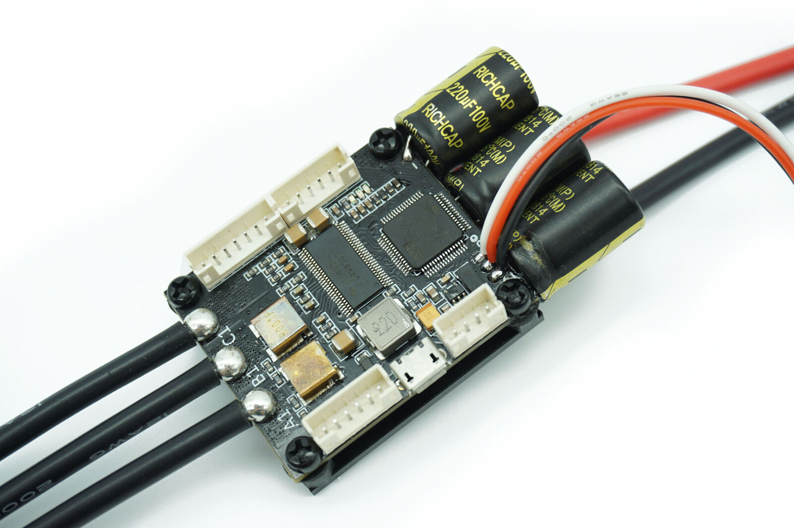

# Arduino Simple Field Oriented Control (FOC) project

We live in very exciting times 😃! BLDC motors are entering the hobby community more and more and many great projects have already emerged leveraging their far superior dynamics and power capabilities. BLDC motors have numerous advantages over regular DC motors but they have one big disadvantage, the complexity of control. Even though it has become relatively easy to design and manufacture PCBs and create our own hardware solutions for driving BLDC motors the proper low-cost solutions are yet to come. One of the reasons for this is the apparent complexity of writing the BLDC driving algorithms, Field oriented control (FOC) being an example of one of the most efficient ones.
The solutions that can be found on-line are almost exclusively very specific for certain hardware configuration and the microcontroller architecture used.
Additionally, most of the efforts at this moment are still channeled towards the high-power applications of the BLDC motors and proper low-cost and low-power FOC supporting boards are very hard to find today and even may not exist.  
Therefore this is an attempt to: 
- 🎯 Demystify FOC algorithm and make a robust but simple Arduino library: [Arduino SimpleFOClibrary](https://docs.simplefoc.com/arduino_simplefoc_library_showcase)
  - <i>Support as many <b>motor + sensor + driver + mcu</b> combinations out there</i>
- 🎯 Develop modular and easy to use FOC supporting BLDC driver boards
   - For official driver boards see [SimpleFOCBoards](https://docs.simplefoc.com/boards)
   - Many many more boards developed by the community members, see [SimpleFOC Community](https://community.simplefoc.com/)

<blockquote class="info" markdown="1">
   
NEW RELEASE 📢: SimpleFOClibrary v2.3.4 <a href="https://github.com/simplefoc/Arduino-FOC/releases/tag/v2.3.4">see release</a>

 - ESP32 MCUs extended support [#414](https://github.com/simplefoc/Arduino-FOC/pull/414)
   - Transition to the arduino-esp32 version v3.x (ESP-IDF v5.x) [#387](https://github.com/espressif/arduino-esp32/releases)
   - New support for MCPWM driver
   - New support for LEDC drivers - center-aligned PWM and 6PWM available 
   - Rewritten and simplified the fast ADC driver code (`adcRead`) - for low-side and inline current sensing.
 - Stepper motors current sensing support [#421](https://github.com/simplefoc/Arduino-FOC/pull/421)
   - Support for current sensing (low-side and inline) - [see in docs](current_sense)
   - Support for true FOC control - `foc_current` torque control - [see in docs](motion_control)
 - New current sense alignment procedure  [#422](https://github.com/simplefoc/Arduino-FOC/pull/422) - [see in docs](current_sense_align)
   - Support for steppers
   - Much more robust and reliable
   - More verbose and informative 
 - Support for HallSensors without interrupts [#4224](https://github.com/simplefoc/Arduino-FOC/pull/424) - [see in docs](hall_sensors) 
 - Docs
   - A short guide to debugging of common issues - [see in docs](example_from_scratch)
   - A short guide to the units in the library - [see in docs](library_units)
 - See the complete list of bugfixes and new features of v2.3.4 [fixes and PRs](https://github.com/simplefoc/Arduino-FOC/milestone/11) 
</blockquote>

# Arduino SimpleFOClibrary <small>- [Read more ...](arduino_simplefoc_library_showcase)</small>

<iframe class="youtube"  src="https://www.youtube.com/embed/Y5kLeqTc6Zk" frameborder="0" allow="accelerometer; autoplay; encrypted-media; gyroscope; picture-in-picture" allowfullscreen></iframe>
This video demonstrates the Simple FOC library basic usage, electronic connections and shows its capabilities.

### Features
- **Easy install**: 
   - Arduino IDE: Arduino Library Manager integration
   - PlatformIO
- **Open-Source**: Full code and documentation available on github
- **Goal**: 
   - Support as many [sensor](position_sensors) + [motor](motors) + [driver](drivers) + [current sense](current_sense)   combination as possible.
   - Provide the up-to-date and in-depth documentation with API references and the examples
- **Easy to setup and configure**: 
   - Easy hardware configuration 
   - Each hardware component is a C++ object (easy to understand) 
   - Easy [tuning the control loops](motion_control)
   - [*Simple**FOC**Studio*](studio) configuration GUI tool
   - Built-in communication and monitoring
- **Cross-platform**:
   - Seamless code transfer from one microcontroller family to another 
   - Supports multiple [MCU architectures](microcontrollers):
      - Arduino: UNO, MEGA, DUE, Leonardo, Nano, UNO R4, MKR ....
      - STM32
      - ESP32
      - Teensy
      - many more ...

# SimpleFOCBoards  <small>- [Read more ...](boards)</small>

One of the goals of the  SimpleFOCproject is to develop low-cost easy to use BLDC driver boards compatible with the SimpleFOClibraryand completely open source! Therefore, SimpleFOC team members have developed a set of boards, designed specifically for ease of use, to help you kickstart your FOC journey. In addition to being easy to use, the goal of these boards is serve as a reference design for the community to build upon. And finally, even though some of these boards are available in our [shop](https://www.simplefoc.com/shop), our docs provide a lot of documentation and step-by-step guides on how to fabricate the boards yourself.

In addition to the official boards, there are many other boards compatible with SimpleFOClibrary  that you can explore, see the [docs](supported_hardware). Additionally, some other cool hardware designs have been proposed by the community. Check out our [community forum](https://community.simplefoc.com/) for more info.

Here are some of the official boards developed by the SimpleFOC team:

## SimpleFOCShield

### Features
- **DRV8313 based** - [datasheet](https://www.ti.com/lit/ds/symlink/drv8313.pdf)
  - Power supply: 8-35V
  - Max current: 2A per phase (3Amp peak)
- **Absolute max ratings** - Designed for Gimbal motors with the internal resistance >10 Ωs. 
   - Max current: 3A, 
   - Max input voltage: 35V
- **In-line current sensing**: Up to 5Amps bidirectional
   - ACS712 hall current sensor
- **Integrated 8V regulator**: 
   - Enable/disable by soldering pads
- **Stackable**: running 2 motors in the same time
- **Encoder/Hall sensors interface**: Integrated 3.3kΩ pullups (configurable)
- **I2C interface**: Integrated 4.7kΩ pullups (configurable)
- **Configurable pinout**: Hardware configuration - soldering connections
- **Arduino headers**: Arduino UNO, Arduino MEGA, STM32 Nucleo boards...
- **Open Source**: 
   - Fully designed in **EasyEDA**: [EasyEDA project](https://oshwlab.com/the.skuric/simplefocshield_copy_copy)
   - Fully available fabrication files - [how to make it yourself](arduino_simplefoc_shield_fabrication)
- **Low-cost**: 
   - JLCPCB production cost ~10-15€
   - Available in the [shop](https://www.simplefoc.com/shop): 15-30€ 

## SimpleFOCMini

### Features
- **DRV8313 based** - [datasheet](https://www.ti.com/lit/ds/symlink/drv8313.pdf)
  - Power supply: 8-35V
  - Max current: 2A per phase (3Amp peak)
- **Absolute max ratings** - Designed for Gimbal motors with the internal resistance >10 Ωs. 
   - Max current: 3A, 
   - Max input voltage: 35V
- **Small size**: 26x21 mm
- **Open Source**: 
   - Fully designed in **EasyEDA**: [EasyEDA project](https://easyeda.com/the.skuric/simplefocmini)
   - Fully available fabrication files - [how to make it yourself](mini_fabrication)
- **Low-cost**: 
   - JLCPCB production cost ~3-5€
   - Available in the [shop](https://www.simplefoc.com/shop): 7-15€ 

A short demo video for the SimpleFOCShield (its a bit outdated but still relevant)

<iframe class="youtube"  src="https://www.youtube.com/embed/G5pbo0C6ujE" frameborder="0" allow="accelerometer; autoplay; encrypted-media; gyroscope; picture-in-picture" allowfullscreen></iframe>

Find out more about the boards and how to make them yourself in the [boards](boards) section. 

## Alternative FOC supporting projects
Over the period of the past few years several cool FOC supporting projects which provide hardware and software solutions have emerged, here are some of them. None of the projects listed uses SimpleFOC. 

Project | Open Source Hardware | Open source firmware | Simple to use | Low cost | Power rating | Stepper Support 
--- | --- | --- | --- | ---  | ---  | --- 
  <a href="https://odriverobotics.com/" >Odrive</a> | ✔️/(❌ from recently) |  ✔️/(❌ from recently) |  ✔️ |  ❌ (>200$) | High >50A | ❌
  <a href="https://github.com/vedderb/bldc">Vesc </a> | ✔️ |  ✔️ |  ✔️ |  ❌ (>100$) | Vey High >100A | ❌
 <a href="https://www.youtube.com/watch?v=g2BHEdvW9bU">Trinamic</a> | ❌ | ❌ | ✔️ |  ❌ (>200$) | Low ~10A | ✔️
 <a href="https://www.infineon.com/cms/en/product/evaluation-boards/bldc_shield_tle9879/" >Infineon</a> |  ✔️ | ❌ | ✔️ | ✔️ (50$) | Low ~10A | ❌
 <a href="https://github.com/gouldpa/FOC-Arduino-Brushless">FOC-Arduino-Brushless</a>  | ✔️ | ✔️ | ❌ |✔️ (Price ?) | Low ~10A |  ❌
 <a href="https://tinymovr.com/">Tinymovr R5.2</a> | ❌ | ✔️|✔️ | ❌ (~90$)  | High (~30A) |  ❌
 <a href="https://tinymovr.com/">Tinymovr M5.2</a> | ❌ | ✔️ |✔️ | ❌ (~90$) | Low (~6Amps) |  ❌
  <a href="https://mjbots.com/">Mjbots moteus</a> | ❌ | ✔️ |✔️|  ❌ (80-160$)  | Mid (9-22Amps) |  ❌
   <a href="https://github.com/open-dynamic-robot-initiative/open-motor-driver-initiative">Open robotics initiative   MicroDriver</a> | ✔️ | ✔️ |❌ | ✔️(~50$)  | Mid (-20Amps) |  ❌
   <a href="https://www.solomotorcontrollers.com/shop/">SOLO</a> | ❌ | ❌ |✔️ | ❌(70$-600$)  | Mid (-16Amps) to Very high (-120Amps) |  ❌

<blockquote class="warning">
⚠️ This list is certainly not exhaustive, feel free to contribute to extending/completing/correcting it! 
</blockquote>

